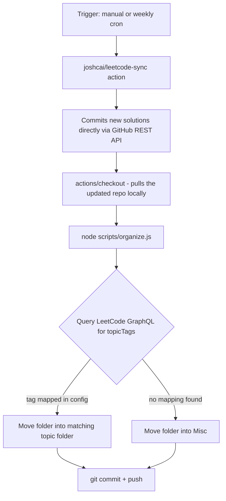

# LeetCode Auto-Sync & Auto-Organize

Automatically sync your accepted LeetCode submissions to GitHub and sort them into topic folders — zero browser extensions, zero shared credentials, runs entirely inside your own repo.

## Why this exists

Most "sync my LeetCode to GitHub" tools ask you to install a browser extension with broad permissions. This approach doesn't. It's a GitHub Actions workflow that talks directly to LeetCode's API using your session cookie, stored as an encrypted repo secret that never leaves GitHub's infrastructure and is never visible to anyone but you.

No extension. No third-party server. No one but you and GitHub ever sees your session token.

## What it does

1. **Syncs** every newly-accepted submission from LeetCode into this repo (via [`joshcai/leetcode-sync`](https://github.com/joshcai/leetcode-sync)).
2. **Organizes** each solution into a topic folder — Arrays, DP, SQL-DBMS, Graphs, etc. — using LeetCode's own topic tags as ground truth, not guesswork.

Run it manually anytime, or let it run automatically once a week.

## Architecture



The sync step and the organize step are architecturally different: sync writes directly to GitHub via API, organize operates on a local checkout. That's why the workflow checks out the repo *after* syncing — the two steps don't share a filesystem by default.

## Setup (10 minutes)

1. Click **Use this template** above to create your own independent copy of this repo. (Not a fork — a template gives you a clean copy with no link back here and no shared secrets.)
2. Go to **Settings → Actions → General → Workflow permissions**, select **Read and write permissions**, save.
3. Log into LeetCode, open DevTools → Network tab, refresh, and grab the `LEETCODE_SESSION` and `csrftoken` cookie values from any request's headers.
4. Go to **Settings → Secrets and variables → Actions**, add two repo secrets: `LEETCODE_SESSION` and `LEETCODE_CSRF_TOKEN`.
5. Go to the **Actions** tab, select **Sync LeetCode**, click **Run workflow**.

That's it. Every future run syncs new solutions and files them into the right topic folder automatically.

## Customizing the categorization

Folder mapping lives entirely in [`config/tag-folder-map.json`](config/tag-folder-map.json) — it's the only file you need to touch to change how things are organized. Add a new tag-to-folder mapping and future runs pick it up with no code changes.

```json
{
  "_default": "Misc",
  "Database": "SQL-DBMS",
  "Dynamic Programming": "DP"
}
```

## Repo structure

```
├── .github/workflows/leetcode_sync.yml   # sync + organize, one job
├── AGENTS.md                             # tells AI coding agents how to use this repo
├── config/tag-folder-map.json            # your categorization rules
├── scripts/organize.js                   # the organizer logic
└── solutions/                            # your synced, auto-sorted solutions
    ├── Arrays/
    ├── SQL-DBMS/
    ├── DP/
    └── ...
```

## Connect an AI coding agent

Because everything here is plain files in folders — not locked behind a dashboard or a proprietary API — any AI coding agent (Claude Code, Cursor, Copilot Workspace) can reason over your entire solving history the moment you clone the repo locally.

`AGENTS.md` at the repo root tells your agent exactly how the folders are structured, so you can immediately ask things like:

- *"Look at my `solutions/DP` folder and tell me what patterns I've covered and what I'm missing."*
- *"Review my `solutions/Graphs` folder for style consistency."*
- *"Based on `solutions/`, suggest my next 5 problems to close gaps."*

No integration setup required — clone, open in your agent of choice, and ask.

## Security notes

- Your `LEETCODE_SESSION` cookie is a live session token — treat it like a password. It's stored as a GitHub encrypted secret, which means it's never printed in logs and never visible in the repo itself.
- Because this is a template (not a fork), your secrets are never inherited by anyone who uses this template — they add their own.
- Session cookies expire periodically; if syncing starts failing, just grab a fresh cookie and update the secret.
- Consider making your copy private if your solutions or notes contain anything you'd rather not make public.

## Credit

Built on top of [`joshcai/leetcode-sync`](https://github.com/joshcai/leetcode-sync) for the sync step. The organize layer, topic-tag mapping, and combined workflow are original.

## License

MIT — use it, fork it, adapt it.