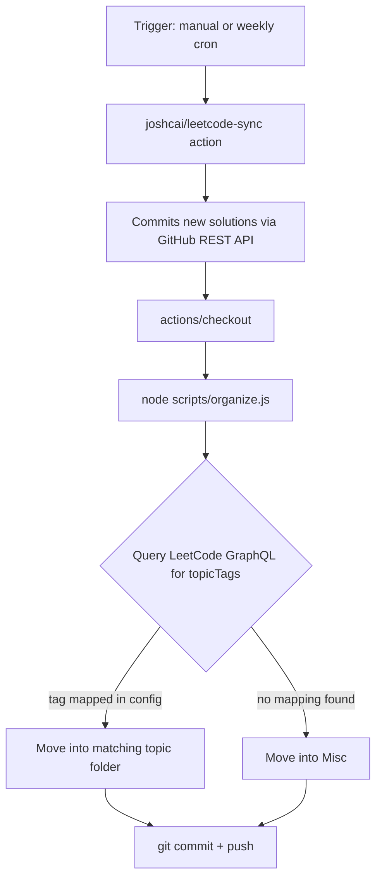

# LeetCode Auto-Sync & Auto-Organize

> Sync accepted LeetCode submissions to GitHub and organize them by topic — no browser extensions, no third-party servers, no shared credentials.

[](https://github.com/isSubham/leetcode-journey/generate)

## Motivation

The existing ecosystem for syncing LeetCode to GitHub largely relies on browser extensions that request broad permissions or third-party services that you have to trust with your session token. This repo takes a different approach: a GitHub Actions workflow that authenticates directly with LeetCode's API using a session cookie stored as an encrypted repo secret. The secret never leaves GitHub's infrastructure, is never printed in logs, and is never visible to anyone — including you — after it's set.

## How it works

Two things happen on every run:

1. [`joshcai/leetcode-sync`](https://github.com/joshcai/leetcode-sync) fetches newly accepted submissions and commits them directly to the repo via GitHub's REST API.
2. `scripts/organize.js` queries LeetCode's GraphQL API for each problem's topic tags, then moves the solution folder into the appropriate subdirectory under `solutions/`.

The workflow runs on a weekly schedule or on-demand via `workflow_dispatch`.

## Architecture



One design detail worth noting: the sync step writes directly to GitHub via API, while the organize step runs against a local checkout. These two steps don't share a filesystem, which is why `actions/checkout` runs *after* the sync — it needs to pull the commits that the sync action just made.

## Setup

**Prerequisites:** a GitHub account and a LeetCode account.

1. Click **Use this template** above and choose **Create a new repository**. Use the template option rather than a fork — this gives you a clean history with no link back to this repo, and your secrets are entirely your own.
2. In your new repo: **Settings → Actions → General → Workflow permissions** → select **Read and write permissions** → Save.
3. Open LeetCode in a browser, log in, and open DevTools (F12) → **Network** tab → refresh the page → click any request → **Headers** → find the `Cookie` header and copy the values of `LEETCODE_SESSION` and `csrftoken`.
4. In your repo: **Settings → Secrets and variables → Actions** → add two repository secrets:
   - `LEETCODE_SESSION`
   - `LEETCODE_CSRF_TOKEN`
5. Go to the **Actions** tab → **Sync LeetCode** → **Run workflow**.

On subsequent runs, new accepted submissions are synced and organized automatically.

## Customizing topic folders

All categorization logic is in [`config/tag-folder-map.json`](config/tag-folder-map.json). It maps LeetCode's topic tag names (exactly as returned by their API) to folder names under `solutions/`. The `_default` key controls the fallback folder for unmapped tags.

```json
{
  "_default": "Misc",
  "Dynamic Programming": "DP",
  "Database": "SQL-DBMS"
}
```

Editing this file is the only change needed to add or rename a topic category — no code changes required.

## Repository structure

```
├── .github/workflows/leetcode_sync.yml   # workflow: sync + organize
├── AGENTS.md                             # context file for AI coding agents
├── CONTRIBUTING.md
├── config/tag-folder-map.json            # topic tag → folder mapping
├── scripts/organize.js                   # organizer script
├── tools/refresh-secrets/                # local utility to rotate session secrets
│   ├── refresh.js
│   └── lib/
│       ├── encryptor.js
│       └── github-client.js
└── solutions/                            # auto-sorted problem solutions
    ├── Arrays/
    ├── DP/
    ├── Graphs/
    └── ...
```

## Using with an AI coding agent

Because solutions live as plain files in a predictable folder structure, any AI agent with filesystem access (Claude Code, Cursor, Copilot Workspace) can reason over your full solving history without any additional setup.

`AGENTS.md` at the repo root describes the folder conventions and suggests useful queries:

- *"What patterns have I covered in `solutions/DP`, and what's missing?"*
- *"Review `solutions/Graphs` for consistency across languages."*
- *"Suggest the next 5 problems based on gaps in `solutions/`."*

## Security

- `LEETCODE_SESSION` is a live session token. It is stored as a GitHub encrypted secret and is never written to logs or visible in the repository.
- Because this is a template repository (not a fork), secrets are never inherited by users who create copies — each user configures their own.
- Session cookies expire periodically by design. When the sync workflow starts failing, see [Session expiry](#session-expiry) below.
- If your solutions contain anything you'd prefer to keep private, set your copy of this repo to private.

## Session expiry

LeetCode session cookies are short-lived. When they expire, the sync workflow will fail with an authentication error (visible in the Actions tab).

Two options for rotating the secrets:

**Option 1 — Manual:** repeat the DevTools cookie-copy steps from Setup above and update the two repo secrets.

**Option 2 — Local script:** from a local clone of the repo, run:

```bash
cd tools/refresh-secrets
npm install        # first time only
cp .env.example .env  # first time only — fill in GITHUB_PAT and GITHUB_OWNER
npm start
```

A browser window opens, you log into LeetCode normally, and the script handles encryption and secret rotation via GitHub's API. Your credentials never touch the script — it only reads the resulting session cookie. See [`tools/refresh-secrets/`](tools/refresh-secrets/) for full setup details.

## Credit

Sync functionality is provided by [`joshcai/leetcode-sync`](https://github.com/joshcai/leetcode-sync). The topic-tag organization layer, config-driven mapping, and combined workflow are original additions.

## License

[MIT](LICENSE)